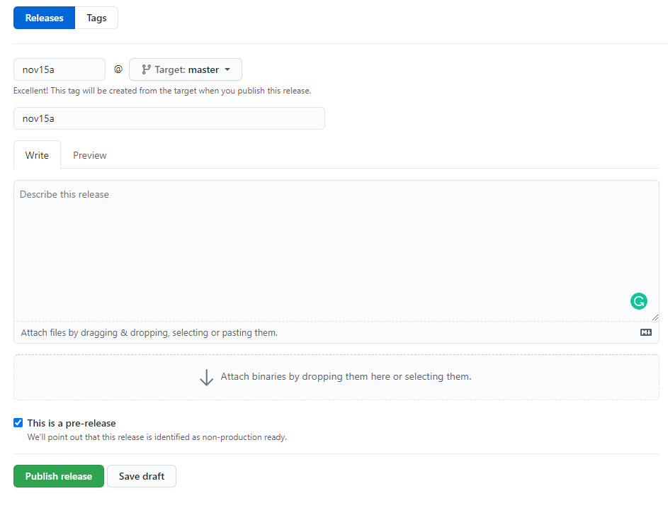
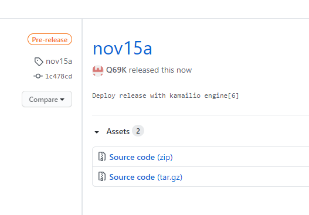
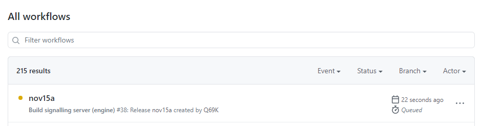
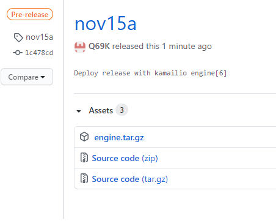
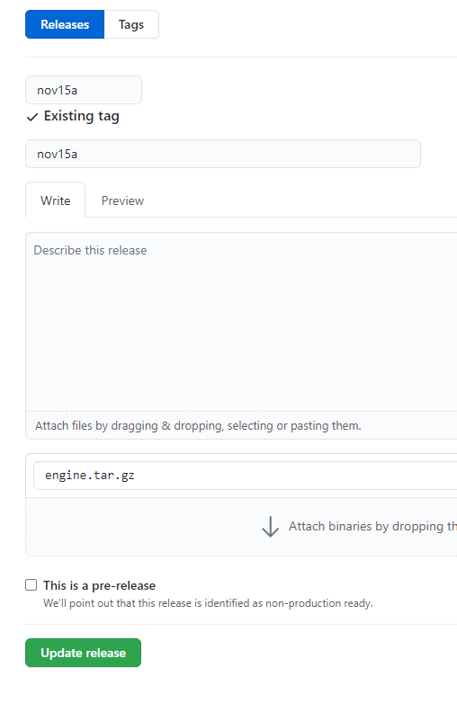

# Production deployment procedure

1. Publish [a pre-release](https://github.com/arigativa/robolive/releases/new)
    
   Select `This is a pre-release` checkbox:
   
   
   You will get a release with just two assets:
   
    
2. Wait [jobs](https://github.com/arigativa/robolive/actions) to build all the artifacts (only `engine.tar.gz` at the moment)
    
   
   
   Check `engine.tar.gz` on release page:
   

3. Release

   Uncheck `This is a pre-release` and save
   
   
4. ...
5. Production is deployed

Deployment is performed by Github Actions described
in [.github/workflows/production.yml](.github/workflows/production.yml)

